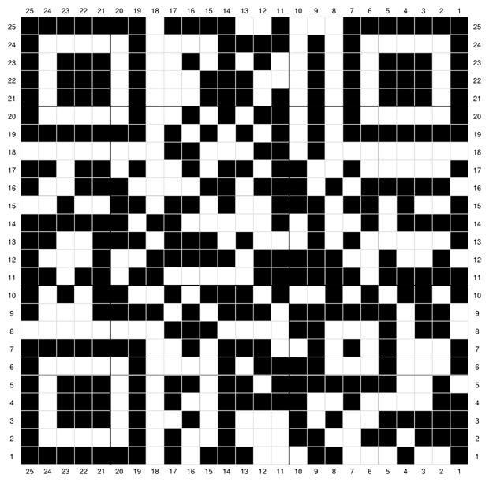

# Bar codes and QR codes
_Source:_ QR codes and barcodes [explained](https://www.youtube.com/watch?v=qYvqFV4Rf8c&t=250s)

### Binary colour data storage
Black and white represent 1 and 0 respectively

#### Barcodes
_Source:_ [How Barcodes work](https://www.youtube.com/watch?v=e6aR1k-ympo) 
- Barcodes divided into 95 vertical bars divided into 15 sections
- 1 start and 1 end guard to identify orientation, one middle guard
- 12 sections corresponding to 12 numbers, again divided into sets of 6
- The first number represents the type of product...and so on according to specifications(12 indices have their significance)

#### QR(Quick Response) codes
_Source:_ [How QR codes work](https://www.youtube.com/watch?v=142TGhaTMtI)
- Grid of squares, 21x21 standard, bigger also used

- Three corners with standard pattern for orientation detection
- Error protection bytes around placeholders
- Bottom right four squares represent data type
- From there one byte at a time, _upward-left_ and _downward-right_ zig zag
- In case of continuous black/white stretches, a mask is used to flip the pixel values at certain cells according to the mask formula (depends on multiple factors)